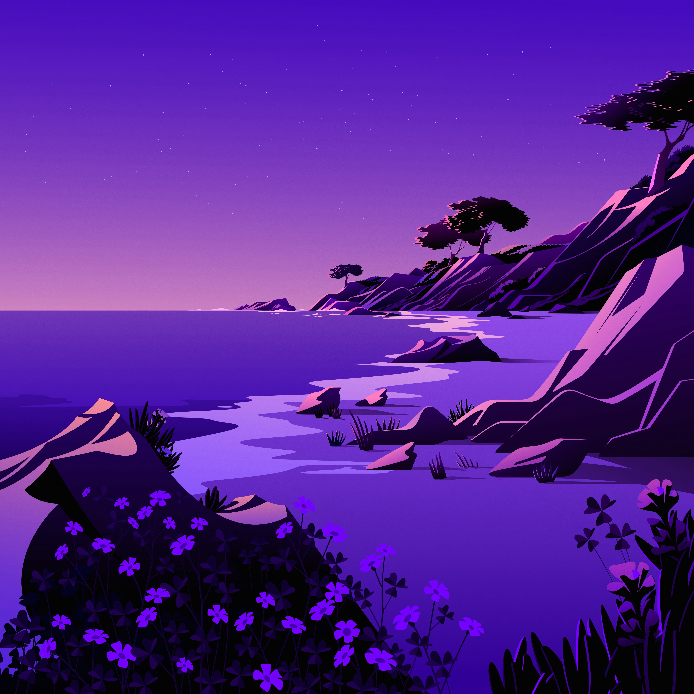
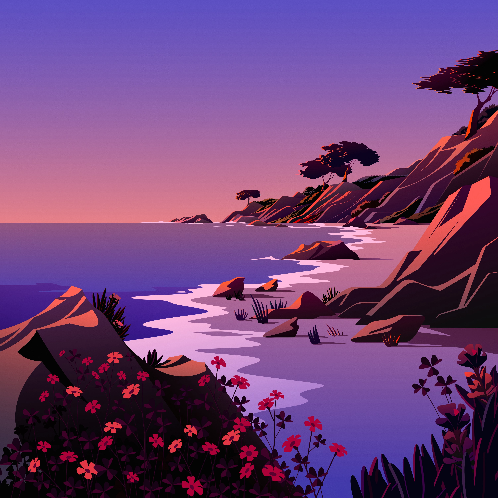
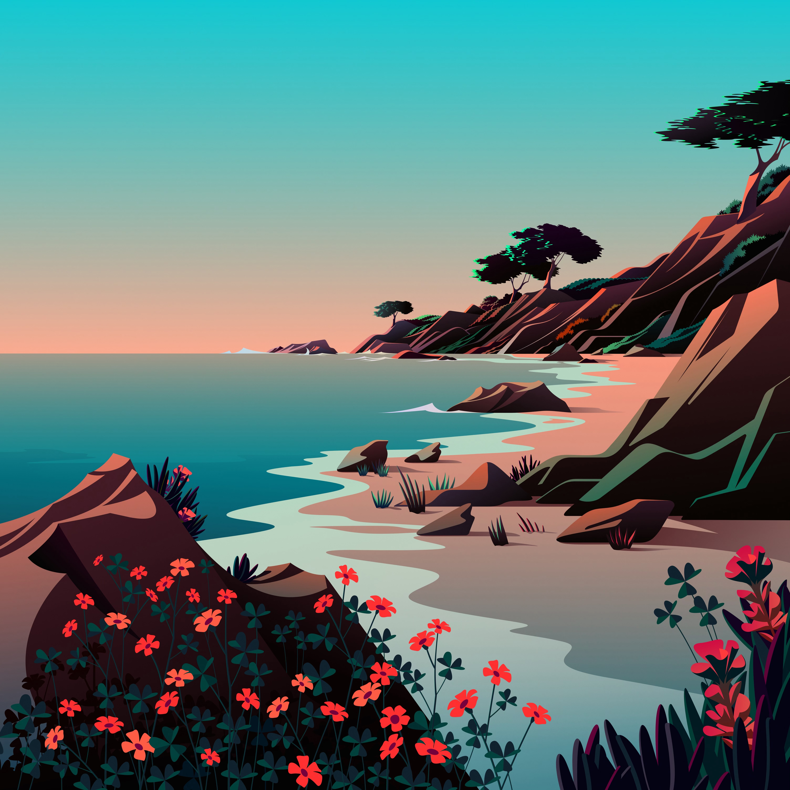

# Wallpaper-engine-w-salah

This is a relatively simple wallpaper engine, which also is able to change your wallpaper based on the salah timings (eg from Green lane Masjid)

> ![warning] NOTE
> This is Currently a **WIP**

It is very close to actually working, but I have other things to do at the moment, soooo, welp.

Also, it currently only works on mac os, but porting should be **veery easy**`*`

## Shifting background examples

This is completely customisable. These are example images I use on my own system:

